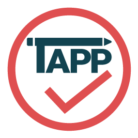
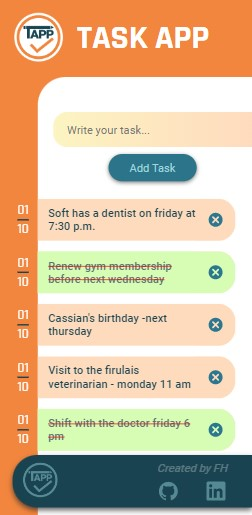
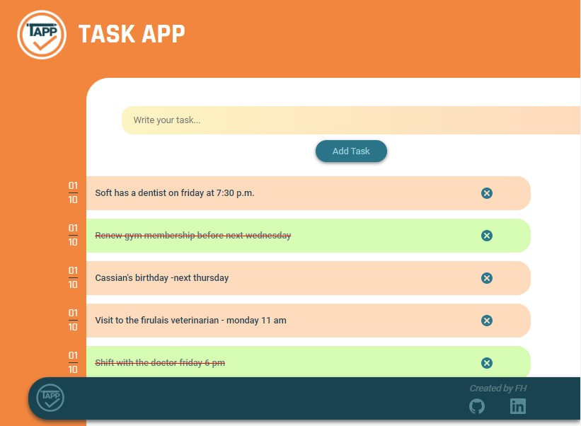
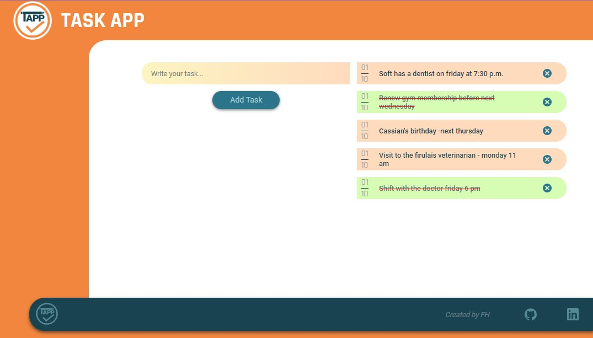

||<h1>TASK APP</h1> |
| :---: | :---: |


App to create tasks made with React CRA.

<br>
<div>
  
  
</div>


Made with the mobile first design concept

## Technologies used

  

          

<br>

---
##  How to run App Task

First copy the HTTPS address from Github.

|

Then we should position ourselves in the directory we want our folder to be downloaded

Next, clone our repository using git clone + the HTTPS address.
Type in the Git terminal:

```
https://github.com/saveasfabri/task-app.git
```

A folder will be created, access it by typing the following line in the terminal:

```
cd task-app
```

After that, you should install all dependencies for it to work properly running the following command:

```
npm install
```

If you do not wish to install them globally and to reduce long time issues you may also run:

```
npx install
```

###### Now you simply must enter

```
npm start
```

Then the app should start running smoothly without any issues.

Success!!!!

<br>

<div>
  
  
</div>
Fabricio Hang


<a href="https://www.linkedin.com/in/fabricioahang/">See on LinkedIn</a>